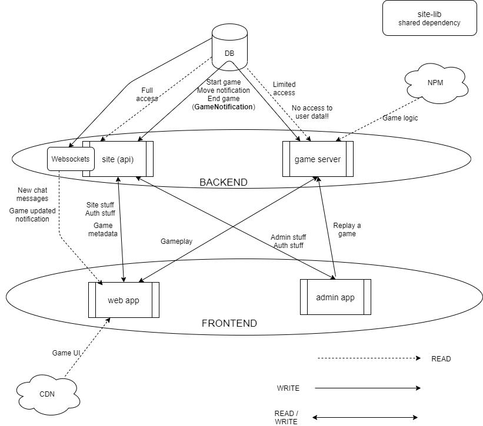

# Architecture

Here is the architecture of the BGS platform. It is just here to provide a look at the environment your game will be running in.

Your game engine will be loaded through NPM, and a CDN will be used to load the UI of your game - inside a sandboxed iframe - to be served to the players.

We believe in separation - for the engine to be independent from the UI. That doesn't mean that they can't be in one module, but the engine should be usable and be interactable with regardless of an UI being present or not.
